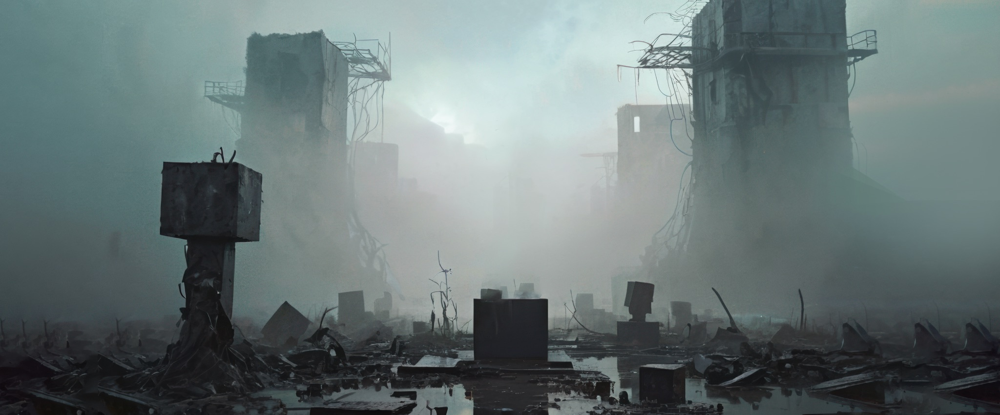

# Reference Images Phenomenology

This note analyzes the reference frames found in `img/`:

- `frame_006.jpeg`
- `frame_011.jpeg`
- `frame_017.jpeg`
- `frame_021.jpeg`
- `frame_032.jpeg`
- `frame_033.jpeg`

Its purpose is not to describe them academically for its own sake, but to extract an aesthetic guidance that can arbitrate technical choices while building the SDF-based tool.

## Core Impression

The dominant impression is not simply "ruin" or "brutalism".

It is a world of:

- mass;
- erasure;
- moisture;
- silence;
- exposure to a blinding void;
- human insignificance in front of damaged monumental forms.

These images do not convey an active catastrophe. They convey its aftermath as a stable condition.

The space feels:

- abandoned but not empty;
- dead but still charged;
- geometric but corrupted;
- open in scale but claustrophobic in feeling.

The atmosphere is less "action" than "oppression", less "narrative event" than "state of being".

## Spatial Phenomenology

The compositions are almost always organized as a corridor, trench, street canyon, or processional axis.

What matters is not free exploration in all directions, but movement through:

- a long forward path;
- flanking vertical masses;
- distant white or pale light;
- intermittent obstacles and fragments on the ground.

This creates a strong experiential structure:

1. the viewer is pushed forward;
2. the sides dominate peripheral vision;
3. the horizon is obscured, never fully revealed;
4. the destination is light, but the light does not promise safety.

The space therefore behaves like a rite of passage or an architectural funnel.

This is important for the tool: the environment should be judged primarily from longitudinal travel, not from free-flight inspection.

## Mass and Form

The dominant forms are extremely simple:

- blocks;
- slabs;
- towers;
- walls;
- rectangular voids;
- isolated monoliths.

Their power comes from:

- scale;
- spacing;
- silhouette;
- repetition with variation;
- damage concentrated at edges, tops, and bases.

The images do not ask for baroque shape complexity. They ask for elementary forms that have been:

- broken;
- eroded;
- stripped;
- partially hollowed;
- exposed to time and collapse.

This is an important arbitration rule:

- if a technical choice increases geometric complexity but weakens silhouette clarity, it is probably the wrong choice;
- if a technical choice preserves a strong block silhouette while adding controlled damage, it is probably the right one.

## Light and Atmospheric Depth

The strongest visual agent is not the object itself, but the interaction between object and atmosphere.

The images rely heavily on:

- dense fog or suspended moisture;
- strong backlight;
- low local contrast away from the light source;
- silhouettes dissolving into haze;
- wet ground catching thin strips of reflected brightness.

Depth is produced less by fine detail than by:

- contrast falloff;
- silhouette stacking;
- volumetric whitening in the distance;
- gradual loss of edge definition.

This means the tool should privilege geometry that reads well in silhouette and in depth layers.

Micro-detail only matters if it survives:

- fog;
- backlight;
- distance;
- compression into dark masses.

## Materiality

The material feeling is:

- concrete;
- wet stone;
- corroded metal;
- muddy or flooded debris;
- exposed reinforcement;
- shattered pavement.

But the images are not primarily about material richness in the PBR sense.

They are about material fatigue:

- softened edges from erosion;
- chipped corners;
- hanging filaments or rebars;
- slick reflective patches on the ground;
- fractured planes catching light unevenly.

The sensation is tactile but austere. Surfaces should not become overly decorative.

The correct mood is:

- austere;
- cold;
- mineral;
- soaked;
- decayed;
- electrically haunted.

## Human Presence

The last frames introduce a human or humanoid silhouette.

This changes the atmosphere in a precise way:

- the environment stops being only architectural;
- it becomes ritual, uncanny, and confrontational;
- scale becomes legible;
- the light source becomes almost metaphysical.

The figure is not expressive through pose. It is expressive through:

- stillness;
- frontal placement;
- isolation;
- silhouette;
- glowing eyes;
- contrast against the void.

This suggests a broader aesthetic rule:

- express meaning through staging and silhouette first, not through animation detail or ornament.

## Emotional Register

The emotional tone can be described as:

- solemn;
- terminal;
- haunted;
- impersonal;
- sacrificial;
- dreamlike;
- post-industrial;
- funereal.

There is also a strong sublime component:

- the viewer is made small;
- the space is indifferent;
- the geometry feels older and heavier than the human body;
- light feels transcendent but hostile.

This is not survival-horror clutter. It is monumental dread.

## Recurrent Visual Motifs

Across the frames, several motifs recur consistently:

- monolithic rectangular masses;
- central vanishing-point composition;
- heavy fog with strong bloom toward the horizon;
- broken ground planes with puddles or sheen;
- sparse debris rather than dense junk;
- dangling wires or rebars;
- voids punched into towers or walls;
- symmetry or near-symmetry disturbed by damage;
- isolated upright markers emerging from the ground;
- strong foreground-to-background scale recession.

These motifs should be treated as first-class design cues.

## What This Means for the SDF Tool

### 1. Primitive vocabulary should stay narrow

The images justify a very small core set of primitives:

- boxes;
- slabs;
- cut voids;
- broken extrusions;
- sparse rod or cable-like details.

A narrow primitive vocabulary is not a limitation here. It is stylistically aligned.

### 2. Large-scale proportion matters more than local intricacy

The tool should make it easy to author:

- tall flank walls;
- interrupted towers;
- repeated volumes along the path;
- broad negative spaces between masses;
- long ground corridors.

If a feature helps produce better procession, rhythm, and silhouette, it has high value.

If it only increases local mesh richness, it has lower value.

### 3. Damage should be concentrated and structural

Damage should favor:

- chipped corners;
- missing chunks;
- torn upper edges;
- punched openings;
- broken ground slabs;
- exposed reinforcement at rupture points.

Damage should not become uniformly noisy across all surfaces.

Uniform noise weakens the monumental feeling. Selective damage preserves it.

### 4. Split strategy should respect compositional continuity

Since the images depend on long corridor readings, sector or cell boundaries should avoid producing visible rhythmic discontinuities in:

- silhouette continuity;
- ground plane flow;
- tower spacing;
- fog-relevant depth layering.

If a technical split choice introduces obvious repetition or cut lines, it should be rejected even if it is simpler.

### 5. UV and bake decisions should support erosion legibility

UVs and baked maps matter here mainly to reinforce:

- edge wear;
- cavity darkening;
- wet or dirty accumulation zones;
- concrete fatigue;
- sharp breaks where mass has fractured.

The bake pipeline should therefore favor signals that strengthen structural aging, not decorative surface noise.

Most useful signals:

- ambient occlusion;
- curvature;
- sharp-edge or fracture emphasis;
- cavity accumulation masks.

### 6. Ground treatment is essential

The ground is not a neutral support. It carries much of the mood.

It should read as:

- broken;
- damp;
- uneven;
- reflective in patches;
- scattered with sparse remnants.

A technically simpler but visually flatter ground solution would betray the references more than a simpler tower solution would.

### 7. Negative space must be preserved

One of the main aesthetic forces in these images is emptiness between masses.

The tool should therefore make it easy to preserve:

- long sightlines;
- void pockets;
- breathing gaps between structures;
- uncluttered silhouettes against light.

Do not fill every gap with detail.

## Practical Arbitration Rules

When a technical decision is ambiguous, prefer the option that better preserves the following:

1. Readability of large silhouettes from the main travel axis.
2. Strong contrast between monolithic masses and atmospheric void.
3. Selective structural damage rather than uniform detail noise.
4. Ground breakup and wet reflectance cues.
5. Longitudinal spatial rhythm and processional composition.
6. Sparse but sharp signs of decay such as rebar, cables, ruptures, and missing chunks.
7. A feeling of oppressive calm rather than visual busyness.

Conversely, distrust choices that produce:

- excessive small-scale greeble;
- overly clean edges everywhere;
- too much surface uniformity;
- too much local clutter;
- weak silhouettes in fog;
- freeform complexity that dilutes the block logic;
- repeated modular patterns that become obvious along the forward path.

## Condensed Aesthetic Directive

If this tool must choose between technical neatness and visual fidelity, it should generally choose the solution that preserves:

- monumental block mass;
- corridor-like progression;
- damaged concrete austerity;
- wet reflective ground;
- fog-mediated depth;
- sparse uncanny markers;
- silence, dread, and ritual stillness.

The target is not "detailed ruins".

The target is **monumental ruin dissolved in mist, where simple forms become spiritually oppressive through scale, damage, emptiness, and light**.
